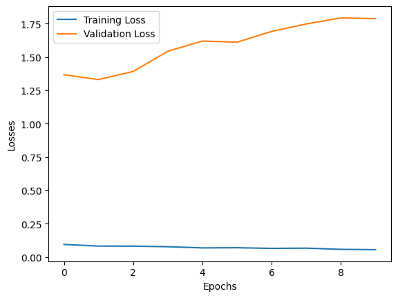

# 🧠 CNN for CIFAR-10 Image Classification

A Convolutional Neural Network (CNN) built from scratch using **PyTorch** to classify images from the **CIFAR-10** dataset. This project demonstrates the complete deep learning workflow, including data preprocessing, model development, training, evaluation, and visualization of learning curves.

> **Note:** This is my first deep learning project using CNNs. The objective was to understand the fundamentals of convolutional neural networks and implement the complete training pipeline from scratch.

---

## 📌 Features

- Built a CNN from scratch using PyTorch
- Image classification on the CIFAR-10 dataset
- Data preprocessing using Torchvision
- Mini-batch training with DataLoader
- Training and validation loss tracking
- Model checkpoint saving
- Performance evaluation on the test dataset
- Loss curve visualization

---

## 🗂 Dataset

The project uses the **CIFAR-10** dataset provided by **Torchvision**.

**Dataset Statistics**

| Property | Value |
|----------|-------|
| Total Images | 60,000 |
| Training Images | 50,000 |
| Test Images | 10,000 |
| Image Size | 32 × 32 RGB |
| Number of Classes | 10 |

The dataset is downloaded automatically when the notebook is executed.

```python
torchvision.datasets.CIFAR10(
    root="./data",
    train=True,
    download=True,
    transform=train_transform
)
```

---

## 🏗 Model Architecture

The CNN consists of the following components:

- Convolutional Layers
- ReLU Activation
- Max Pooling Layers
- Fully Connected Layers
- Softmax Classification (via CrossEntropyLoss)

---

## ⚙ Training Configuration

| Parameter | Value |
|----------|-------|
| Framework | PyTorch |
| Optimizer | Adam |
| Loss Function | CrossEntropyLoss |
| Epochs | 10 |
| Dataset | CIFAR-10 |

---

## 📈 Results

### Test Accuracy

**75.35%**

### Training Curve

> Add your loss graph here after uploading it to the repository.

```markdown

```

### Observations

- Training loss decreases consistently throughout training.
- Validation loss increases after the initial epochs.
- This indicates **overfitting**, where the model learns the training data well but struggles to generalize to unseen data.

---

## 📁 Project Structure

```
cnn-cifar10-image-classification/
│
├── CNN_for_CIFAR10.ipynb
├── README.md
├── requirements.txt
├── .gitignore
└── images/
    └── loss_curve.png
```

---

## 🚀 Getting Started

### Clone the repository

```bash
git clone https://github.com/Yash-sahh/cnn-cifar10-image-classification.git
cd cnn-cifar10-image-classification
```

### Install dependencies

```bash
pip install -r requirements.txt
```

### Run the notebook

```bash
jupyter notebook
```

The CIFAR-10 dataset will be downloaded automatically on the first run.

---

## 📚 What I Learned

Through this project, I gained practical experience with:

- Image preprocessing
- Convolutional Neural Networks
- Forward and backward propagation
- Model training using PyTorch
- Loss functions and optimization
- Model evaluation
- Saving trained models
- Understanding overfitting
- Visualizing training performance

---

## 🔮 Future Improvements

Some techniques that can further improve the model include:

- Data Augmentation
- Dropout Layers
- Weight Decay (L2 Regularization)
- Early Stopping
- Learning Rate Scheduling
- Hyperparameter Tuning
- Transfer Learning using ResNet or VGG

---

## 🛠 Technologies Used

- Python
- PyTorch
- Torchvision
- NumPy
- Matplotlib
- Jupyter Notebook

---

## 📄 License

This project is created for educational and learning purposes.

---

## 👨‍💻 Author

**Yash Sahu**

GitHub: https://github.com/Yash-sahh

If you found this project helpful, consider giving it a ⭐.
